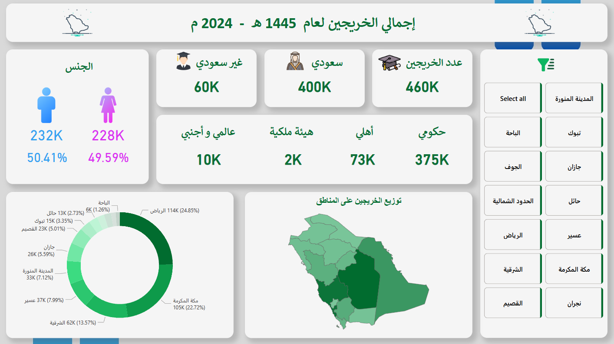

# 🎓 Graduates Analysis Dashboard 2024

> **🇸🇦 Saudi Open Data Platform**  
> Interactive Power BI dashboard analyzing graduate data across regions, government authorities, gender, and nationality.

## 🖼️ **Dashboard Preview**

---

## 🎯 **Project Overview**

This project focuses on analyzing graduate data to identify patterns and differences across **geographical regions, government authorities, gender, and nationality**.

The dashboard transforms graduate data into an interactive visual analysis that enables users to explore graduate distributions and compare different demographic dimensions.

---

## 📊 **Key Analysis Areas**

### 👨‍🎓 **Graduate Distribution**

- 📍 Analysis of graduates across different regions
- 🏢 Comparison between government authorities
- 👩‍🎓👨‍🎓 Gender-based graduate analysis
- 🇸🇦 Comparison of Saudi and non-Saudi graduates

### 🗺️ **Geographical Analysis**

- 📍 Regional distribution of graduates
- 🏙️ Comparison between regions
- 📊 Identification of differences in graduate concentrations

### 🏢 **Government Authority Analysis**

- 🏛️ Comparison of graduate numbers across government authorities
- 📈 Ranking and comparison of authorities
- 🔍 Interactive exploration of authority-level data

---

## 🛠️ **Technical Implementation**

### 📊 **Tools & Technologies Used**

- **🎯 Microsoft Power BI** – Dashboard development & data visualization
- **📈 Microsoft Excel** – Data preparation and analysis
- **⚡ DAX** – Measures and analytical calculations
- **🔄 Power Query** – Data transformation and preparation
- **📋 PivotTables** – Data aggregation and comparative analysis

### 🎨 **Dashboard Features**

- **📊 Interactive Visualizations** – Dynamic graduate analysis
- **🗺️ Regional Analysis** – Geographic comparison
- **🏢 Authority Comparison** – Government authority performance analysis
- **👥 Demographic Analysis** – Gender and nationality breakdown
- **🎛️ Interactive Filtering** – Dynamic exploration of graduate data

---

## 💼 **Insights & Analytical Value**

### 🎯 **Key Insights**

- 📍 Reveals differences in graduate distribution across regions.
- 🏢 Highlights variations between government authorities.
- 👥 Provides demographic comparisons by gender.
- 🇸🇦 Shows the distribution of Saudi and non-Saudi graduates.
- 📊 Enables multi-dimensional exploration of graduate data.

### 💡 **Business Value**

- 📊 Supports graduate workforce analysis
- 🗺️ Provides regional distribution insights
- 🏢 Enables comparison across government authorities
- 👥 Supports demographic analysis
- 💡 Facilitates data-driven interpretation of graduate data

---

## 🏆 **Project Highlights**

### ✅ **Successfully Delivered**

- 📊 Interactive Power BI graduates dashboard
- 🗺️ Regional distribution analysis
- 🏢 Government authority comparison
- 👥 Gender analysis
- 🇸🇦 Nationality analysis
- 📋 PivotTable-based data exploration

### 🚀 **Analytical Skills Demonstrated**

- 🔍 Multi-dimensional data analysis
- 📊 Data visualization and dashboard development
- 📋 PivotTable analysis
- ⚡ DAX-based calculations
- 🔄 Data transformation using Power Query
- 💡 Data storytelling and insight generation

---

## 📋 **Project Details**

**📌 Project Type:** Data Analysis Project  
**🇸🇦 Data Source:** Saudi Open Data Platform  
**📊 Domain:** Graduate & Demographic Analytics  
**🛠️ Tools:** Power BI, Excel, DAX, Power Query, PivotTables  
**📅 Analysis Year:** 2024  
**🎯 Focus:** Regions, Government Authorities, Gender & Nationality  
**✅ Status:** Completed Successfully

---

> **🚀 This project demonstrates the ability to transform open government data into an interactive analytical dashboard and communicate graduate distribution patterns through clear, multi-dimensional visualizations.**
